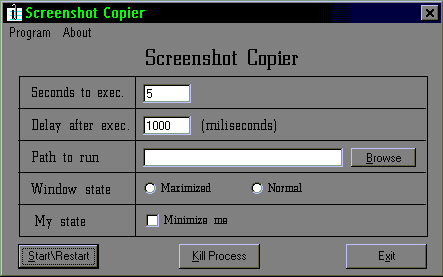



## Automatic Screenshot Copier

### Description

Clipboard copier uses milisecond precision to grab a certain screenshot on the monitor. For example, if you want to grab the splash screen from VB, you can use this program to specify the exact timing of your screenshot. It provides a place to put an optional path to run, a place for a timing delay after the path is run, and other features. If you like it, please take the time to vote for it.
 
### More Info
 
It returns a screenshot specified by the consumer.

             |
---                |---
**Submitted On**   |2001-04-19 17:41:08
**By**             |[Shane Skowron](https://github.com/Planet-Source-Code/PSCIndex/blob/master/ByAuthor/shane-skowron.md)
**Level**          |Intermediate
**User Rating**    |4.7 (14 globes from 3 users)
**Compatibility**  |VB 6\.0
**Category**       |[Graphics](https://github.com/Planet-Source-Code/PSCIndex/blob/master/ByCategory/graphics__1-46.md)
**World**          |[Visual Basic](https://github.com/Planet-Source-Code/PSCIndex/blob/master/ByWorld/visual-basic.md)
**Archive File**   |[Automatic 185674192001\.zip](https://github.com/Planet-Source-Code/shane-skowron-automatic-screenshot-copier__1-22532/archive/master.zip)

### API Declarations

All declares are in the zip

